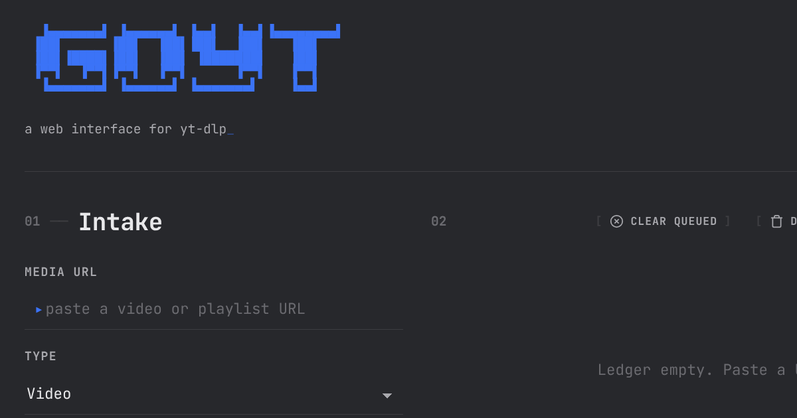

# goyt

A self-hosted, cross-platform web interface for yt-dlp, written in Go. Download video and audio from any site yt-dlp supports, with ffmpeg handling merging and optional re-encoding.



## Features

- **Multi-format downloads**: MP4, MKV, WebM, AVI video and MP3, M4A, WAV, FLAC audio
- **Fast by default**: Video is remuxed into the chosen container without re-encoding; optional H.264 + AAC transcode for older devices
- **Terminal-inspired web UI**: Single dark theme, JetBrains Mono, responsive and mobile-friendly
- **Concurrent downloads**: Configurable worker pool (1-10) with queue management
- **Live progress**: Real-time download and ffmpeg processing progress per item
- **Queue controls**: Pause, resume, cancel, retry, and bulk clear of queued/completed/failed items
- **Playlist handling**: Automatic playlist detection with whole-playlist or first-video options
- **In-browser playback**: Stream completed video/audio in a built-in player
- **Duplicate detection**: Skips items already queued or already present on disk, with a clear notice
- **Cookies support**: Optional Netscape cookies.txt for sites needing login (one file, multiple domains)
- **Checksum-verified auto-updates**: yt-dlp is downloaded and updated automatically, with SHA-256 verification before install
- **Optional password gate**: PBKDF2-hashed web UI login with signed session cookies
- **Secure defaults**: Binds to loopback (127.0.0.1) by default; auto-cleanup of old completed files
- **Configurable**: Settings via config file, CLI flags, or environment variables
- **Cross-platform binaries**: Tagged releases build Linux, macOS, and Windows (amd64 + arm64)
- **Tested**: Go unit tests plus a Puppeteer UI test suite

## Quick Start

### Prerequisites
- **ffmpeg**: Installed and on the system PATH (or set `ffmpeg_path`). On
  Windows, if ffmpeg is missing, goyt offers to download a SHA-256-verified
  build from gyan.dev on first run; on other systems it exits and asks you to
  install ffmpeg, then restart.
- **Python 3.9+** (Linux only): the Linux yt-dlp build is the Python zipapp and
  needs Python at runtime. The macOS and Windows builds are standalone and do
  not. The Docker image already includes Python.
- **A JavaScript runtime** (for YouTube): yt-dlp must run JavaScript to solve
  YouTube's nsig challenge. Without one, YouTube returns only image (storyboard)
  formats and downloads fail with "Requested format is not available". Install
  [Deno](https://deno.com/) (used automatically when present) or Node.js 22+
  (goyt enables it with `--js-runtimes node`). Most other sites do not need this.
- **Go 1.26+**: For building from source
- **Node.js 18+**: For building CSS assets (separate from the runtime above;
  Node 22+ also satisfies the YouTube JavaScript-runtime requirement)

### Installation

#### Option 1: Pre-built Binaries
Download the latest release for your platform from the [Releases](https://github.com/bradsec/goyt/releases) section.

#### Option 2: Build from Source
```bash
git clone https://github.com/bradsec/goyt.git
cd goyt
npm install && npm run build
./goyt
```

`npm run build` compiles the CSS, copies fonts, and builds the binary with all
assets (HTML, CSS, JS, fonts, icons) embedded, so the resulting `goyt` binary
is self-contained.

### First Run
1. The application automatically downloads yt-dlp on first startup (needs internet). If ffmpeg is missing, Windows users are offered an automatic download; other platforms must install ffmpeg manually.
2. Access the web interface at `http://localhost:3000`.
3. Configure settings as needed via the web UI.

## Command Line Options

```bash
./goyt [options]

Options:
  -port int        Port to run the server on (overrides config file)
  -bind string     Address to bind to, e.g. 0.0.0.0 for all interfaces (overrides config file)
  -config string   Path to configuration file (default "config.json")

Subcommands:
  ./goyt setpass    # set or change the web UI password
  ./goyt clearpass  # remove the web UI password

Examples:
  ./goyt -port 3000              # Run on port 3000
  ./goyt -bind 0.0.0.0           # Expose on all interfaces (LAN access)
  ./goyt -config myconfig.json   # Use custom config file

# Environment Variables
export GOYT_PORT=3000            # Set port via environment
export GOYT_BIND=0.0.0.0         # Set bind address via environment
export WEBUI_PASSWORD=secret     # Enable the login gate without setpass
```

## Configuration

The application creates a `config.json` file on first run with default settings:

```json
{
  "download_path": "./downloads",
  "max_concurrent_downloads": 3,
  "yt_dlp_path": "./assets/yt-dlp/yt-dlp",
  "ffmpeg_path": "ffmpeg",
  "cookies_file_path": "",
  "bind_address": "127.0.0.1",
  "port": 3000,
  "default_video_format": "mp4",
  "default_audio_format": "mp3",
  "default_video_quality": "1080p",
  "verbose_logging": false,
  "completed_file_expiry_hours": 72,
  "enable_hardware_acceleration": false,
  "optimize_for_low_power": false,
  "reencode_for_compatibility": false,
  "playlist_load_timeout_seconds": 180,
  "download_start_timeout_seconds": 60
}
```

### Configuration Options
- **download_path**: Directory for downloaded files
- **max_concurrent_downloads**: Number of simultaneous downloads (1-10)
- **yt_dlp_path**: Path to yt-dlp binary (auto-managed)
- **ffmpeg_path**: Path to ffmpeg binary
- **cookies_file_path**: Optional Netscape-format cookies.txt passed to yt-dlp for sites that need a login or block anonymous access. One file holds entries for multiple domains; yt-dlp sends only the cookies matching the URL being downloaded, and the file is applied to both downloads and URL validation. You can set this path (handy for a Docker volume or manual drop-in) or upload a file from **Settings → Cookies file** (Upload / Remove, with a status line). Uploads are written to this path when set, otherwise to `cookies.txt` next to `config.json`. In Docker, set this to a persisted location (for example `/app/downloads/cookies.txt`) so the file survives container recreation
- **bind_address**: Network interface to listen on. Defaults to `127.0.0.1` (loopback only). Set to `0.0.0.0` to allow LAN access; put it behind a reverse proxy with auth/TLS when exposed
- **port**: Web server port
- **verbose_logging**: Enable detailed logging
- **completed_file_expiry_hours**: Auto-cleanup completed downloads after N hours (0 = never)
- **enable_hardware_acceleration**: Use hardware-accelerated encoding when re-encoding (if available)
- **optimize_for_low_power**: Optimize for battery-powered devices
- **reencode_for_compatibility**: Conditionally re-encode video to H.264 + AAC for older devices. Off by default, so downloads keep the exact format you select (each download is remuxed into the chosen container by stream copy, no transcode). When enabled, any download that is not already H.264 + AAC is transcoded to H.264 + AAC afterwards; this overrides the codecs of a non-MP4 format, so it will not keep its native codecs. Codecs are detected with ffprobe. Audio extraction is unaffected. Completed downloads display a codec badge (e.g., "H.264 · AAC") showing the actual video and audio codecs, with a per-video **Convert** button to transcode a single file to H.264 + AAC (MP4) on demand; the button hides once a file is already H.264 + AAC
- **playlist_load_timeout_seconds**: Time to wait for a playlist to load (10-1800, default 180). Raise on slow networks or for very large playlists
- **download_start_timeout_seconds**: Time to wait fetching video info before a download starts (10-1800, default 60). Raise on slow networks

Saving settings with a `yt_dlp_path` or `ffmpeg_path` that does not resolve (on
disk or via PATH) is allowed but surfaces a non-blocking warning in the UI.
The `webui_password_hash` and `session_secret` fields are managed by the
`setpass`/`clearpass` subcommands; do not edit them by hand.

## Web UI Password (Optional)

By default the web interface is open with no login required.

### Setting a password

Run the `setpass` subcommand. It prompts for a password with hidden input and stores a PBKDF2 hash (never plaintext) plus a session secret in `config.json`. Restart goyt for the change to take effect. The hash and secret live in `config.json`, so they persist across rebuilds and restarts.

```bash
./goyt setpass    # set or change the password
./goyt clearpass  # remove the password (re-opens the UI)
```

When a password is set, all pages and API endpoints require a valid session except the login and health endpoints.

### Containers and headless setups

Set the `WEBUI_PASSWORD` environment variable. It overrides the stored hash and enables the login gate without running `setpass`:

```bash
WEBUI_PASSWORD=yourpassword ./goyt
```

### Sessions and TLS

Sessions use an HttpOnly cookie with a 7-day expiry. For remote access, terminate TLS at a reverse proxy so the cookie is transmitted securely.

## API Endpoints

### Core Operations
- `GET /api/config` - Get current configuration
- `POST /api/config` - Update configuration
- `GET /api/downloads` - List all downloads
- `POST /api/downloads` - Start a new download
- `POST /api/downloads/playlist` - Start playlist download
- `POST /api/downloads/first-video` - Download first video from playlist
- `POST /api/validate` - Validate URL and detect playlists

### Download Management
- `DELETE /api/downloads/{id}` - Remove a download
- `POST /api/downloads/{id}/cancel` - Cancel active download
- `POST /api/downloads/{id}/pause` - Pause download
- `POST /api/downloads/{id}/resume` - Resume paused download
- `POST /api/downloads/{id}/retry` - Retry failed download
- `GET /api/downloads/{id}/download` - Download completed file
- `GET /api/downloads/{id}/stream` - Stream completed file (in-browser player)

### Bulk Operations
- `POST /api/downloads/clear-queued` - Clear all queued downloads
- `POST /api/downloads/delete-completed` - Delete all completed downloads
- `POST /api/downloads/clear-failed` - Clear all failed downloads

### System
- `GET /api/yt-dlp/version` - Check for yt-dlp updates
- `POST /api/yt-dlp/update` - Update yt-dlp
- `GET /api/versions` - Get current yt-dlp and ffmpeg versions

## Testing

Run the complete test suite:

```bash
# Run all tests (Go + UI)
npm test

# Run only Go tests
go test ./...

# Run only UI tests (requires a server running on localhost:3000)
npm run test-ui
```

The UI test suite uses Puppeteer to check:
- Page loading and the ASCII banner header
- Form fields and submit-button validation
- Settings panel and its fields
- Download status sections and empty state
- Responsive layout (no horizontal overflow on mobile)
- API connectivity and absence of console errors

## Production Deployment

Recommended baseline: 512MB+ RAM, 1GB+ disk for downloads, `ffmpeg` installed
and on `PATH`, and a reverse proxy for TLS. Tune `max_concurrent_downloads` to
your bandwidth and set `completed_file_expiry_hours` to manage storage.

### Quick Production Setup

1. **Build for production:**
   ```bash
   npm run build-production
   ```

2. **Set environment variables:**
   ```bash
   export GOYT_PORT=3000
   export GOYT_BIND=0.0.0.0
   ```

3. **Run with a systemd service:**
   ```bash
   sudo systemctl enable goyt
   sudo systemctl start goyt
   ```

### Systemd Service (Linux)

```ini
[Unit]
Description=goyt video downloader
After=network.target

[Service]
Type=simple
User=goyt
WorkingDirectory=/opt/goyt
ExecStart=/opt/goyt/goyt -config /etc/goyt/config.json
Restart=on-failure
RestartSec=5

[Install]
WantedBy=multi-user.target
```

Save as `/etc/systemd/system/goyt.service`, then `sudo systemctl daemon-reload`.

### Reverse Proxy (nginx)

Terminate TLS at the proxy and forward to goyt (bound to `127.0.0.1`):

```nginx
server {
    listen 80;
    server_name yourdomain.com;

    location / {
        proxy_pass http://localhost:3000;
        proxy_http_version 1.1;
        proxy_set_header Upgrade $http_upgrade;
        proxy_set_header Connection 'upgrade';
        proxy_set_header Host $host;
        proxy_set_header X-Real-IP $remote_addr;
        proxy_set_header X-Forwarded-For $proxy_add_x_forwarded_for;
        proxy_set_header X-Forwarded-Proto $scheme;
        proxy_cache_bypass $http_upgrade;
    }
}
```

### Docker

A multi-stage `Dockerfile` builds the CSS assets and Go binary, then ships a
small Alpine runtime with `ffmpeg`, `python3` (required by the yt-dlp zipapp),
`deno` (JavaScript runtime for YouTube's nsig challenge), and `ca-certificates`.
The container runs as a non-root user, binds to
`0.0.0.0` so the published port is reachable, and includes a `/health`
healthcheck. yt-dlp is downloaded and checksum-verified on first start.

#### Docker Compose (recommended)
```bash
docker compose up -d --build
```

Then open `http://localhost:3000`. Saved files land in `./downloads` on the
host; the auto-downloaded yt-dlp binary persists in the `ytdlp` volume across
container recreates.

#### Password and sessions in Docker

Use the `WEBUI_PASSWORD` environment variable to set the web UI password in a
container: uncomment it in `docker-compose.yml` (or pass `-e WEBUI_PASSWORD=...`
to `docker run`). It enables the login gate without `setpass` and needs no
persisted file.

The `setpass` subcommand is the native (non-container) method; in a container it
requires `docker exec -it` and only persists if `config.json` is bind-mounted.
By default `config.json` is not persisted, so the auto-generated `session_secret`
is regenerated on each restart, which logs users out (they can log back in).
To keep login and sessions stable across restarts, bind-mount the config file:

```yaml
    volumes:
      - ./downloads:/app/downloads
      - ./config.json:/app/config.json
      - ytdlp:/app/assets/yt-dlp
```

#### Plain Docker
```bash
docker build -t goyt .
docker run -d --name goyt \
  -p 3000:3000 \
  -v "$(pwd)/downloads:/app/downloads" \
  -v goyt-ytdlp:/app/assets/yt-dlp \
  goyt
```

To enable the login gate, also set `-e WEBUI_PASSWORD=yourpass`. To keep
sessions stable across restarts, bind-mount the config file as well with
`-v "$(pwd)/config.json:/app/config.json"`.

### Troubleshooting

- **Port already in use**: change `port` in `config.json`, or use `-port` /
  `GOYT_PORT`.
- **Permission denied**: ensure the binary is executable (`chmod +x goyt`).
- **yt-dlp update fails on startup**: check internet access and that GitHub is
  reachable; the existing binary in `./assets/yt-dlp/` is still used if the
  update cannot be fetched.
- **Downloads fail**: confirm `ffmpeg` is installed and on `PATH`
  (`ffmpeg -version`); failed downloads now report yt-dlp's own error text.

Logs go to stdout/stderr; enable `verbose_logging` in `config.json` for detail.

## Development

### Project Structure
```
goyt/
├── cmd/goyt/           # Main application entry point and CLI banner
├── internal/
│   ├── api/            # HTTP handlers, middleware, and routing
│   ├── config/         # Configuration management
│   ├── core/           # Download engine and yt-dlp integration
│   ├── manager/        # Download queue management
│   ├── ui/             # Web UI templates and embedded assets
│   └── utils/          # Shared utilities
├── tests/              # Test suites
├── docs/               # Documentation
└── scripts/            # Build and deployment scripts
```

### Frontend Assets
The UI is styled with Tailwind CSS v4 (CSS-first config in `input.css`),
compiled to `internal/ui/assets/css/main.css`. Static assets are embedded into
the Go binary via `go:embed`, so rebuild the binary after changing CSS, JS, or
images. Run `npm run build-css` (or `watch-css`) before `go build`; `npm run
build` chains them in the correct order.

### Contributing
1. Fork the repository
2. Create a feature branch
3. Make your changes
4. Run tests: `npm test`
5. Submit a pull request

## Acknowledgements

goyt is a web front end and would not exist without these projects:

- **[yt-dlp](https://github.com/yt-dlp/yt-dlp)** - the download engine that does the actual work (Unlicense). goyt downloads and updates the yt-dlp binary at runtime; it is not bundled or modified.
- **[FFmpeg](https://ffmpeg.org/)** - media muxing, conversion, and transcoding (LGPL/GPL). Provided by the user's system, not bundled.
- **[Deno](https://deno.com/)** - JavaScript runtime yt-dlp uses to solve YouTube's nsig challenge (MIT). Provided by the user's system or the Docker image, not bundled. Node.js 22+ works as an alternative.
- **[JetBrains Mono](https://www.jetbrains.com/lp/mono/)** - the typeface used throughout the UI, by JetBrains (SIL Open Font License 1.1).
- **[Tailwind CSS](https://tailwindcss.com/)** - styling (MIT).
- **[Go](https://go.dev/)** - language and standard library (BSD-3-Clause).

Each dependency is the property of its respective authors and remains under its
own license. The ASCII banner and UI design are original to this project.

## License

This project is open source and available under the MIT License.

Note: yt-dlp and FFmpeg are separate programs with their own licenses (yt-dlp is
Unlicense; FFmpeg is LGPL/GPL depending on build). goyt invokes them as external
tools and does not distribute them.
